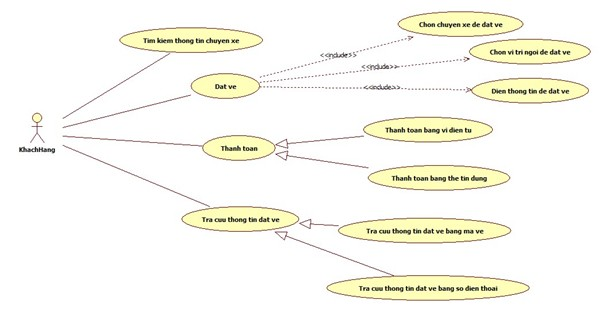
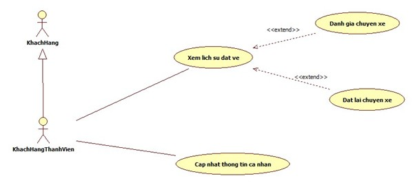
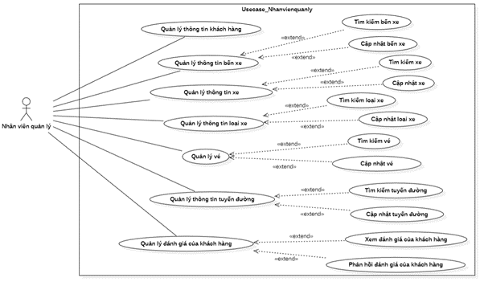
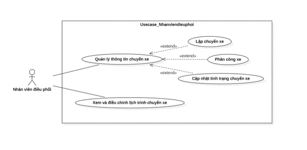
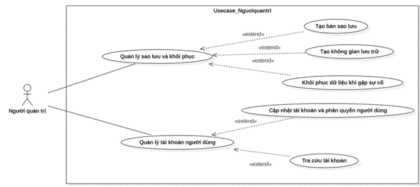
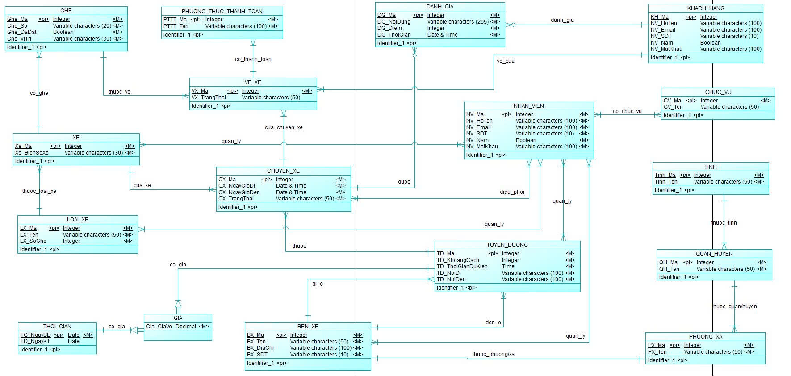

# Giới thiệu về bản thân  
Họ Tên: Nguyễn Quốc Khanh  
MSSV: B2203448  
Ngành: Hệ Thống Thông Tin  
Trường: Đại Học Cần Thơ  

Website Hệ Thông Quản Lý Bán Vé Xe Khách

I. Giới thiệu chung    

1.1 Mục tiêu
    Mục tiêu của đề tài "Quản lý Bán Vé Xe khách" là tạo ra một  hệ thống này mang lại sự thuận tiện vượt trội khi cho phép người dùng dễ dàng đặt vé trực tuyến, lựa chọn chỗ ngồi, thanh toán linh hoạt và kiểm tra lịch trình chuyến đi mọi lúc, mọi nơi. Điều này góp phần nâng cao trải nghiệm khách hàng và giảm thiểu thời gian chờ đợi khi mua trực tiếp tại quầy. Ngoài ra hệ thống còn hỗ trợ doanh nghiệp trong việc quản lý thông tin khách hàng, kiểm soát số lượng vé bán ra, theo dõi doanh thu và lập báo cáo thống kê một cách nhanh chóng, chính xác

1.2 Mô tả đề tài  
1.2.1 Phạm vi đề tài  
    Quản lý bán vé xe khách là một hệ thống phục vụ nhu cầu di chuyển của hành khách trên toàn quốc, với mục tiêu tạo điều kiện thuận lợi nhất cho việc đặt vé và sử dụng dịch vụ của khách hàng. Hệ thống giúp hành khách dễ truy cập thông tin về lịch trình, giá vé và tình trạng chỗ ngồi, các địa điểm bến xe, đặt vé, chọn chỗ ngồi, thanh toán. Ngoài ra, hệ thống sẽ gợi ý các tuyền đường quen thuộc phù hợp cho khách hàng thường xuyên đặt vé.  
1.2.2 Nhóm người dùng chính  
    - Khách hàng: tìm kiếm thông tin chuyến xe, đặt vé, tra cứu thông tin vé xe, thanh toán.  
    - Khách hàng thành viên: tìm kiếm thông tin chuyến xe, đặt vé, tra cứu thông tin vé xe, thanh toán, xem lịch sử đặt vé, cập nhật thông tin cá nhân.  
    - Nhân viên quản lý: quản lý thông tin khách hàng, quản lý thông tin bến xe, quản lý thông tin xe và loại xe, quản lý thông tin tuyến đường, quản lý vé, quản lý đánh giá khách hàng.  
    - Nhân viên điều phối: quản lý thông tin chuyến xe, xem và điều chỉnh lịch trình chuyến xe.  
    - Người quản trị: quản lý sao lưu và khôi phục, quản lý tài khoản người dùng.  
1.2.3 Các chức năng chính của hệ thống  
    - Quản lý thông tin khách hàng   
    - Quản lý thông tin chuyến xe  
    - Quản lý thông tin tuyến đường  
    - Quản lý thông tin bến xe  
    - Quản lý thông tin xe và loại xe  
    - Quản lý đặt vé xe  
    - Quản lý nhân viên  

II. Các sơ đồ thiết kế  
2.1 Sơ đồ UseCase  
2.1.1 Chức năng actor "Khách Hàng"  
  
2.1.2 Chức năng actor "Khách Hàng Thành Viên"
  
2.1.3 Chức năng actor "Quản Lý"  
  
2.1.4 Chức năng actor "Nhân Viên Điều Phối"  
  
2.1.5 Chức năng actor "Admin"  
  
2.2 ERD  
  

